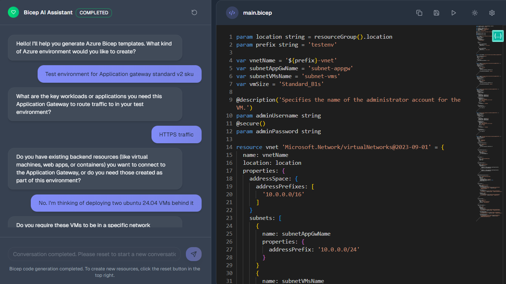
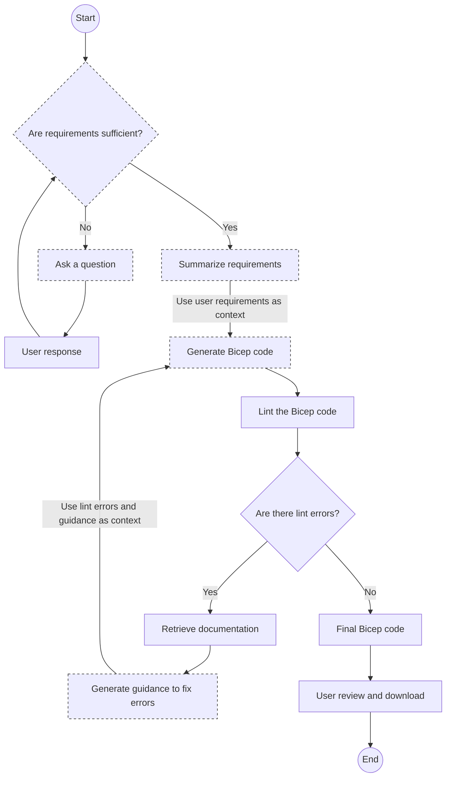

# AI-Powered Bicep Code Generator for Azure Infrastructure



This is an AI-powered chat application that automates the creation of infrastructure as code (IaC) for Azure infrastructure using Bicep, leveraging LLMs to understand user requirements and generate the code. To make sure the generated code is accurate and adheres to best practices, it incorporates feedback from the Bicep lint tool and retrieves Microsoft docs references. The system operates in the following phases:

1. **Understands** user requirements interactively through a chat interface.
2. **Summarizes** the requirements once the system determines enough information has been collected.
3. **Generates** Bicep code based on the summarized requirements.
4. **Validates** the generated code using Bicep linting tool.
5. If linting errors are found, it retrieves relevant context from the linting results and Bicep documentation, and regenerates the code.
6. Repeats the generation and validation cycle until the code passes linting or reaches a maximum number of attempts.

## Why need this?

- **Target**: Azure engineers (especially Azure Infra engineers)
- **Problem**: Time-consuming and error-prone to create Azure environments with unique requirements (e.g. PoC)
- **Goal**: Streamline and automate the process of generating Bicep code for Azure infrastructure, making it easier and faster for engineers to create tailored environments.

## How to run

### Prerequisites

- Python 3.12+
- Node.js 18+
- pnpm
- Azure CLI or bicep CLI

### Setup

1. Configure the Azure OpenAI environment variables in a `.env` file.

```env
AZURE_OPENAI_ENDPOINT=https://your-endpoint.openai.azure.com/
AZURE_OPENAI_DEPLOYMENT_NAME=your-deployment-name
OPENAI_API_VERSION=2024-02-15-preview
CHAT_DEPLOYMENT_NAME=your-chat-deployment-name
CODE_DEPLOYMENT_NAME=your-code-deployment-name
```

2. Start the backend server.

```powershell
cd backend

# Option 1: venv
python3 -m venv .venv
.venv/bin/activate # Linux/macOS
.venv\Scripts\activate.ps1 # Windows PowerShell
pip install -r requirements.txt
python -m uvicorn app:app --host 127.0.0.1 --port 8000 --reload --app-dir ..

# Option 2: uv
uv run -m uvicorn app:app --host 127.0.0.1 --port 8000 --reload --app-dir ..
```

3. Start the frontend server.

```powershell
cd frontend
pnpm install
pnpm dev
```

4. Access the application at [http://localhost:3000](http://localhost:3000).

## How it works



## License

This project is licensed under the MIT License (SPDX: MIT). See the `LICENSE` file for details.
